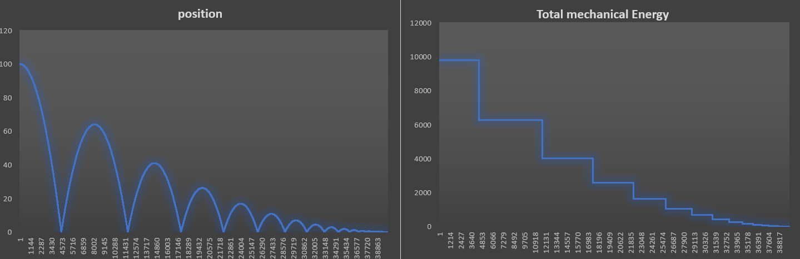

# very Simple NodeJS Physics
This is a very simple nodeJS script designed to roughly simulate an object bouncing in a 1D world.
  Note that it has a lot of flaws and it is just calculating everything roughly, for example, E is not constant whilst free falling but it is in the real world.
  performance may vary, weirdly, mostly based on what terminal you use
# graphs generated using the output data

